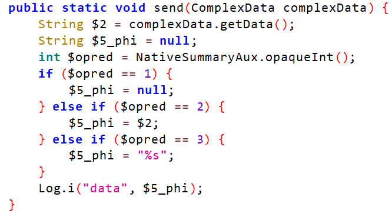

# NativeSummary

A new inter-language Android application static analysis framework using static analysis (based on BinAbsInspector) instead of symbolic execution to make binary code analysis more efficient. To make binary analysis results more generic, we translate the semantic summary extracted from binary code to java bytecode, inject the generated method body into the corresponding native method on the java side, and repack it as a new apk file.

## Docker images for android native code taint analysis tools

the docker images is publicly available at https://hub.docker.com/u/nativesummary

- NativeSummary [Docker Image](https://hub.docker.com/r/nativesummary/nativesummary) [Source](https://github.com/NativeSummary/NativeSummary)
- JN-SAF [Docker Image](https://hub.docker.com/r/nativesummary/jnsaf) [Modified Source](https://github.com/NativeSummary/Argus-SAF)
- Jucify [Docker Image](https://hub.docker.com/r/nativesummary/jucify) [Modified Source](https://github.com/NativeSummary/JuCify)


## Introduction

NativeSummary is capable of discovering behaviors in native code of android apps.

**Root Detection**: searching for "su" executable in native code:


**Stack Trace Detection**: get stack trace in native code:


NativeSummary is also capable of lift some native code behaviors to bytecode level:

**dataflow**



**return string constants**


### Quick Start

mount apk or a folder containing apk files as /apk. create a output folder and mount to `/out`. (the repacked apk is under `/out/repacked_apks/`)

Two different way to use this docker container:
1. analyze single apk file: (recommended)
    ```bash
    docker run --rm -it -v /dataset/nfbe/native_handle-release-unsigned.apk:/apk -v /nfbe-results/native_handle-release-unsigned.apk:/out nativesummary/nativesummary
    ```
1. analyze apk files in a folder
    first modify variables in `scripts/cmds-gen.py`
    ```bash
    ./scripts/cmds-gen.py --apk /home/user/ns/dataset/nfb --out /tmp/test1 | sud
o xargs -0 -I CMD --max-procs=1 bash -c CMD
    ```
1. analyze apk files in a folder (depricated)
    ```bash
    docker run --rm -it -v /dataset/nfbe:/apk -v /nfbe-results:/out nativesummary/nativesummary
    ```

**Bulk Analysis**

`scripts/docker_runner_xargs.py` is a script for bulk analysis. Specify apk dataset path (`--apk`) and output path (`--out`), then pipe the command output to `xargs -0 -I CMD --max-procs=1 bash -c CMD`. Here you can change the value 1 in `--max-procs=1` to run simultaneously.

```
usage: docker_runner_xargs.py [-h] --apk APK --out OUT [--timeout TIMEOUT] [--binary_timeout BINARY_TIMEOUT]
                              [--ss_file SS_FILE] [--run_flowdroid] [--selected_arch SELECTED_ARCH]
                              [--perfer_32] [--no_opt] [--no_model] [--call_string_k CALL_STRING_K]
                              [--k_set_k K_SET_K] [--binary_jni_timeout BINARY_JNI_TIMEOUT]

NativeSummary docker run command generator. Pipe output to xargs to execute commands. Usage:
/home/user/ns/dev/NativeSummary/scripts/docker_runner_xargs.py | xargs -0 -I CMD --max-procs=1 bash -c CMD

optional arguments:
  -h, --help            show this help message and exit
  --apk APK             apk or apk folder path
  --out OUT             output folder path
  --timeout TIMEOUT     Timeout value
  --binary_timeout BINARY_TIMEOUT
                        Binary timeout value
  --ss_file SS_FILE     SS file
  --run_flowdroid       Run FlowDroid
  --selected_arch SELECTED_ARCH
                        Selected architecture
  --perfer_32           Prefer 32-bit
  --no_opt              Disable optimization
  --no_model            Disable model
  --call_string_k CALL_STRING_K
                        Call string K
  --k_set_k K_SET_K     K set K
  --binary_jni_timeout BINARY_JNI_TIMEOUT
                        Binary JNI timeout
```

To stop containers according to container name prefix:

```
docker ps --filter name=ns-* --filter status=running -aq | xargs docker kill
```

**Configurations**

Check out the `get_ns_docker_command` in `scripts/docker_runner_xargs.py`.

- use `NS_TIMEOUT` to limit the running time of the whole analysis. the value is directly passed to [`timeout`](https://man7.org/linux/man-pages/man1/timeout.1.html). for example: `NS_TIMEOUT=2h`
- `BINARY_TIMEOUT` set a timeout for the whole binary analysis. 
- use `GHIDRA_NS_ARGS` env variable to pass arguments to ghidra scripts.
    - To set timout for each analyzed native method: `-e GHIDRA_NS_ARGS="@@-timeout 1000"`
- use `NS_PREFER_32=True` to prefer 32-bit arm binary.
- use `NS_SELECT_ARCH` to directly select an arch. (must in ['arm64-v8a', 'armeabi-v7a', 'armeabi'])
- if --taint is specified, Flowdroid will be run after repacking. (In image args, for example: `docker run ... ns --taint`.)
    - By default, the taintbench sources and sinks is used. to modify souces and sink file, mount to `/root/ss.txt`, for example `-v xxx/ss.txt:/root/ss.txt`

Most of the time are spent on the binary analysis. It is recommended to set the binary analysis timeout (`BINARY_TIMEOUT`) as the expected running time (`NS_TIMEOUT`) minus 30 minutes.

**FlowDroid timeouts**

FlowDroid can cost a lot of time. To make flowdroid save current result instead of being killed without any result, set the following timeout values.

There are Three timeout flags in flowdroid. pass a pure number to specify the timeout in seconds. For large apps, the total running time of flowdroid is a little above the main dataflow timeout plus callback timeout.

- `FLOWDROID_TIMEOUT` (`--timeout` flag in flowdroid) Main dataflow timeout. Set to your expected flowdroid running time.
- `FLOWDROID_CALLBACK_TIMEOUT` (`--callbacktimeout` flag in flowdroid). Timeout for callback analysis and value analysis. This is another place where flowdroid can hang. Set to a relative small percentage of your expected flowdroid running time.
- `FLOWDROID_RESULT_TIMEOUT` (`--resulttimeout` flag in flowdroid) Timeout value for result collection. This usually does not spent much time and does not timeout. Defaults to 600.

**Result Layout**(folder mode)
- `/out/repacked_apks` repackaged apk files.
- `/out/repacked_apks/xxx.apk.sinks.txt` generated native specific sinks.
- `/out/xxxx.native_summary/xxx.so.summary.ir.ll` human-readable SummaryIR
- `/out/xxxx.native_summary/xxx.so.summary.java_serialize` serialized SummaryIR java object
- `/out/xxxx.native_summary/project` ghidra project
- `/out/xxxx.native_summary/xxx.so.funcs.json` JNI binding info (without dynamic registration)
- `/out/xxxx.native_summary/xxx.so.log` binary analysis log file.
- `/out/xxxx.native_summary/xxx.so.perf.json` binary analysis statistics(coverage, time ...)
- `/out/xxxx.native_summary/xxx.so.txt` binary analysis running time.
- `/out/xxxx.native_summary/02-built-bodies.jimple` jimple body built for native methods.

## projects layout

main projects layout for this organization account:

- native_summary_bai/pre_analysis: preanalysis module.
    - requires platforms folder
- native_summary_bai: binary analysis module based on BinAbsInspector
    - uses NativeSummaryIR
- native_summary_java: Generate body for native methods in APK.
    - uses NativeSummaryIR
    - requires platforms folder

## Development - build docker image

- recursive clone this project. 
    - `git clone`
    - `git submodule update --init --recursive`
- build native_summary_bai and build native_summary_java.
- download `ghidra_10.1.2_PUBLIC_20220125.zip` here
- run `copy-release.sh` to copy build artifacts to `./root` directory
- build docker image

```bash
docker build . --tag ns --build-arg UBUNTU_MIRROR=mirrors.ustc.edu.cn --build-arg PYTHON_MIRROR=pypi.tuna.tsinghua.edu.cn
```

to move image to another machine, first export image to a tar file using `docker save ns -o ns.tar`, then import using `docker load -i ns.tar`
